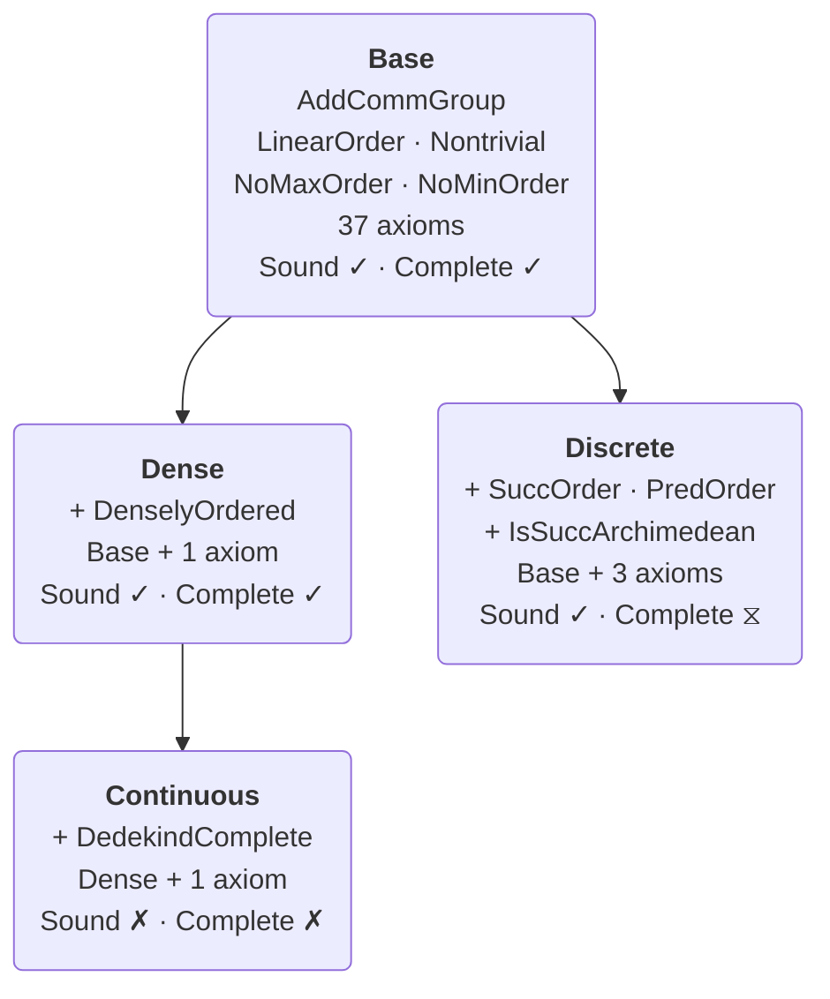

# A Bimodal Logic for Tense and Modality

[](https://github.com/benbrastmckie/ProofChecker/actions/workflows/ci.yml)

A Lean 4 formalization of the **intensional bimodal fragment** of the [Logos](https://logos-labs.ai/) providing a formal language designed for tense and modal reasoning. Unlike extensional (truth-functional) approaches which directly assign truth-values to formulas, or Kripke semantics which evaluates formulas for truth at primitive worlds, the **task semantics** presented below evaluates formulas at both a world-history and time, where world-histories are appropriately constrained functions from times to world-states. This approach provides natural semantic clauses for tense, modality, and their interaction which are essential for planning by reasoning about past and future contingency.

The repository implements the syntax, task semantics, proof theory, and metalogic for the _Bimodal Logic Tense and Modality_ (TM) which combines S5 modal operators with the Since/Until temporal operators.

**Paper**: ["The Construction of Possible Worlds"](https://benbrastmckie.com/wp-content/uploads/2026/05/possible_worlds.pdf) (Brast-McKie, 2025) — compositional semantics for bimodal logics grounded in non-deterministic dynamical systems

**Specification**: [BimodalReference.pdf](Theories/Bimodal/latex/BimodalReference.pdf) — complete axiom schemas and proof-theoretic documentation

**Demo**: [BimodalProofs.lean](Theories/Bimodal/Examples/BimodalProofs.lean) — sorry-free demonstration proofs

| Metric | Count |
|--------|-------|
| Lean files | 189 |
| Lines of code | ~42,700 |
| Comment lines | ~28,400 |

To get current numbers (excludes `.lake` dependencies and `Boneyard/`):

```bash
cloc --include-lang=Lean --exclude-dir=.lake,lake-packages,Boneyard .
```

---

## Operators

The logic uses 5 primitive connectives. All other operators are derived.

### Primitive

| Symbol | Lean Constructor | Reading |
|--------|-----------------|---------|
| `⊥` | `bot` | falsum |
| `φ → ψ` | `imp φ ψ` | material conditional |
| `□φ` | `box φ` | necessity ("necessarily φ") |
| `U(φ,ψ)` | `untl φ ψ` | "ψ until φ" |
| `S(φ,ψ)` | `snce φ ψ` | "ψ since φ" |

### Derived

| Symbol | Definition | Reading |
|--------|-----------|---------|
| `¬φ` | `φ → ⊥` | negation |
| `φ ∧ ψ` | `¬(φ → ¬ψ)` | conjunction |
| `φ ∨ ψ` | `¬φ → ψ` | disjunction |
| `◇φ` | `¬□¬φ` | possibility |
| `Fφ` | `U(φ, ¬⊥)` | "eventually φ" |
| `Pφ` | `S(φ, ¬⊥)` | "previously φ" |
| `Gφ` | `¬F¬φ` | "it is always going to be φ" |
| `Hφ` | `¬P¬φ` | "it always has been φ" |
| `△φ` | `Hφ ∧ φ ∧ Gφ` | "always φ" |
| `▽φ` | `¬△¬φ` | "sometimes φ" |
| `Xφ` | `U(φ, ⊥)` | "at the next moment φ" |
| `Yφ` | `S(φ, ⊥)` | "at the previous moment φ" |

---

## Task Semantics

A **task frame** `F = (W, D, R)` consists of a set `W` of world-states, a totally ordered commutative group `D` of durations, and a **task relation** `R : W → D → W → Prop` satisfying three constraints: *nullity* (each world-state transitions to itself in zero time), *compositionality* (accessibility composes forward across durations), and *reflection* (if `w ⇒_x u` then `u ⇒_{-x} w`).

A **world-history** `τ` in a task frame `F` is a function `τ : X → W` from a convex subset `X ⊆ D` to world states that respects the task relation: for all times `x, y ∈ X` with `x ≤ y`, we have `τ(x) ⇒_{y-x} τ(y)`.

A **task model** `M = (F, I)` extends a task frame `F` with an interpretation function `I : W → Atom → Prop` that assigns truth values to sentence letters `Atom := {p_i : i ∈ ℕ}` at each world state. Truth is evaluated relative to a model `M`, a world-history `τ`, and a time `x`:

- `M, τ, x ⊨ p_i` iff `x ∈ dom(τ)` and `I(τ(x), p_i)`
- `M, τ, x ⊨ ⊥` never
- `M, τ, x ⊨ φ → ψ` iff `M, τ, x ⊭ φ` or `M, τ, x ⊨ ψ`
- `M, τ, x ⊨ □φ` iff `M, σ, x ⊨ φ` for all world-histories `σ`
- `M, τ, x ⊨ U(φ,ψ)` iff there exists `y > x` with `M, τ, y ⊨ φ` and `M, τ, z ⊨ ψ` for all `z` with `x < z < y`
- `M, τ, x ⊨ S(φ,ψ)` iff there exists `y < x` with `M, τ, y ⊨ φ` and `M, τ, z ⊨ ψ` for all `z` with `y < z < x`

Relative to a world-history, any duration `x` may be referred to as the *time* after `x` duration from the origin (the additive unit `0` in `D`) in that world-history.

The task semantics is developed in ["The Construction of Possible Worlds"](https://benbrastmckie.com/wp-content/uploads/2026/05/possible_worlds.pdf) (Brast-McKie, 2025) and relates to non-deterministic dynamical systems: a world-history is a trajectory through the space of world-states where any world-state in the trajectory can transition to another in the difference between their times.

---

## Project Structure

```
ProofChecker/
├── Theories/
│   └── Bimodal/                  # TM bimodal logic library
│       ├── Syntax/               # Formula types, atoms, signed formulas
│       ├── ProofSystem/          # Axioms (44 constructors, 7 layers)
│       ├── Semantics/            # TaskFrame, WorldHistory, TaskModel
│       ├── Metalogic/            # Soundness, completeness, decidability
│       │   ├── Core/             # MCS theory, deduction theorem
│       │   ├── Bundle/           # BFMCS construction (base completeness)
│       │   ├── BXCanonical/      # BX chronicle mixed construction
│       │   ├── WeakCanonical/    # Reynolds/Doets discrete pipeline
│       │   └── Decidability/     # Tableau procedure with proof extraction
│       ├── FrameConditions/      # Dense/discrete frame soundness
│       ├── Theorems/             # Perpetuity principles P1-P6
│       └── Automation/           # Proof search tactics
├── Tests/                        # Test suite
└── docs/                         # Project documentation
```

---

## Installation

**Requirements**: Lean 4 v4.27.0-rc1 and Lake (included with Lean).

```bash
# Install elan (Lean version manager)
curl https://raw.githubusercontent.com/leanprover/elan/master/elan-init.sh -sSf | sh

# Clone and build (first build downloads Mathlib cache, ~30 minutes)
git clone https://github.com/benbrastmckie/ProofChecker.git
cd ProofChecker
lake build
```

For detailed setup instructions, see [Installation Guide](docs/installation/BASIC_INSTALLATION.md).

---

## Metalogical Results

The metalogic is organized around a base axiom system with three extensions: Dense, Continuous, and Discrete. All soundness results are sorry-free and axiom-free (no `sorryAx` dependency). Completeness is established for the base and dense systems; continuous and discrete completeness have remaining obligations.



### Axiom Systems

| System | Axioms | Additional Axioms | Standard Model | Soundness | Completeness |
|--------|--------|-------------------|----------------|-----------|--------------|
| **Base** | 37 | seriality built in (`⊤ → F⊤`, `⊤ → P⊤`) | — | `soundness` | `completeness` |
| **Discrete** | 40 | `Fφ → U(φ,¬φ)`, `Pφ → S(φ,¬φ)`, `G(Gφ→φ) → (FGφ→Gφ)` | ℤ | `soundness_discrete` | `completeness_discrete` |
| **Dense** | 38 | `Fφ → FFφ` | ℚ | `soundness_dense` | `completeness_dense` |
| **Continuous** | 39 | `G(Pφ → FPφ) → (Pφ → Fφ)` | ℝ | — | — |

The base system includes propositional (4), S5 modal (5), Burgess-Xu temporal (22), modal-temporal interaction (1), and uniformity (5) axioms. The Dense and Discrete logics are independent extensions — neither subsumes the other. The Continuous logic extends the Dense logic with the completeness axiom CO, which characterizes Dedekind-complete ordered groups. Since every Archimedean discrete order is conditionally complete, CO is already valid on discrete frames; it only adds content over dense frames, distinguishing ℚ-like from ℝ-like time.

**Active sorry obligations**:

- *Discrete completeness* (`WeakCanonical/Transfer.lean`, `WeakCanonical/Separation/`): Multiple sorries in the Reynolds/Doets pipeline — truth lemma backward cases (G/H/Until/Since), monadic FO Tarski semantics, and gap-elimination lemmas. These represent standard model-theoretic results (Doets 1989) pending formalization.

---

## Documentation

### Reference

- [Axiom Reference](Theories/Bimodal/docs/reference/AXIOM_REFERENCE.md) — complete axiom schemas for all 44 constructors
- [Operator Reference](Theories/Bimodal/docs/reference/OPERATORS.md) — formal operator definitions
- [Tactic Reference](Theories/Bimodal/docs/reference/TACTIC_REFERENCE.md) — custom proof tactics
- [Specification Document](Theories/Bimodal/latex/BimodalReference.pdf) — full formal specification

### User Guides

- [Tutorial](Theories/Bimodal/docs/user-guide/TUTORIAL.md) — introduction to writing bimodal proofs
- [Contributing](docs/development/CONTRIBUTING.md) — contribution guidelines

### Research

- [Bimodal Logic](docs/research/bimodal-logic.md) — theoretical foundations and Logos connection
- [Metalogic README](Theories/Bimodal/Metalogic/README.md) — architecture of the completeness proof

---

## Related Projects

- **[ModelChecker](https://github.com/benbrastmckie/ModelChecker)** — Python/Z3 countermodel generation for Logos semantics. Together with ProofChecker, this forms the dual verification architecture: ModelChecker searches for countermodels while ProofChecker constructs formal derivations.
- **[Logos Laboratories](https://logos-labs.ai/)** — the broader Logos project of which this bimodal logic is a fragment.

---

## Citation

If you use this project in your research, please cite:

```bibtex
@article{brastmckie2025construction,
  title     = {The Construction of Possible Worlds},
  author    = {Brast-McKie, Benjamin},
  year      = {2025},
  url       = {https://benbrastmckie.com/wp-content/uploads/2026/05/possible_worlds.pdf}
}

@software{proofchecker2025,
  title     = {ProofChecker: Lean 4 Formalization of Bimodal Logic TM},
  author    = {Brast-McKie, Benjamin},
  year      = {2025},
  url       = {https://github.com/benbrastmckie/ProofChecker}
}
```

**Key references**:

- Burgess, J. P. (1982). Axioms for tense logic. I. "Since" and "Until." *Notre Dame Journal of Formal Logic*, 23(4), 367–374.
- Xu, M. (1988). On some U,S-tense logics. *Journal of Philosophical Logic*, 17(2), 181–202.
- Reynolds, M. (1994). Axiomatising U and S over integer time. *Advances in Modal Logic*.
- Venema, Y. (1993). Since and Until. *Advances in Modal Logic*.
- Doets, K. (1987). *Completeness and Definability: Applications of the Ehrenfeucht Game in Second-Order and Intensional Logic*.
- Gabbay, D., Hodkinson, I., & Reynolds, M. (1994). *Temporal Logic: Mathematical Foundations and Computational Aspects*, Vol. 1.
- Blackburn, P., de Rijke, M., & Venema, Y. (2002). *Modal Logic*. Cambridge University Press.

---

## License

This project is licensed under GPL-3.0. See [LICENSE](LICENSE) for details.
