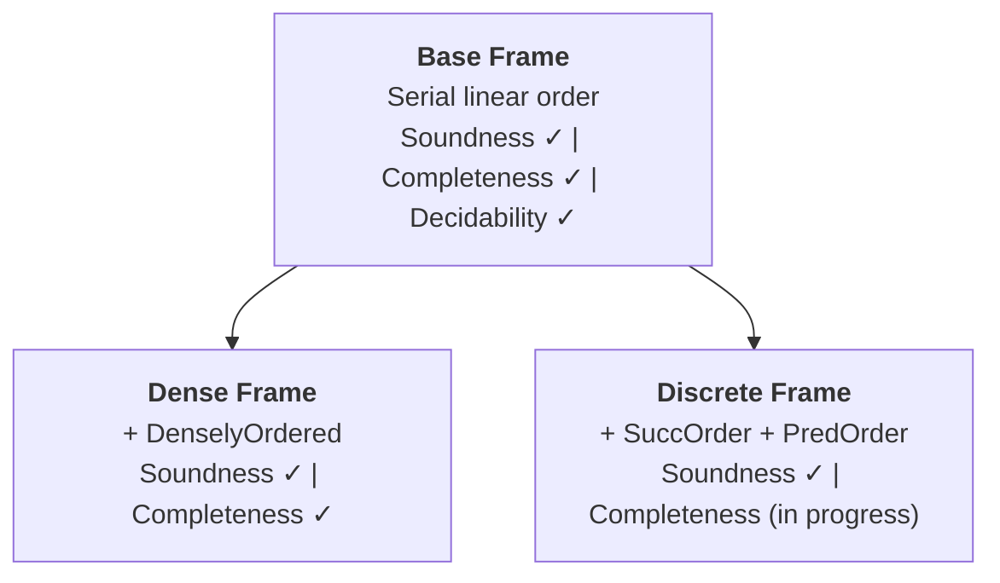

# Logos: Bimodal Logic (Tense and Modality)

[](https://github.com/benbrastmckie/ProofChecker/actions/workflows/ci.yml)

A Lean 4 formalization of the **intensional bimodal fragment** of the [Logos](https://logos-labs.ai/) — a formal language designed for compositional reasoning over possible worlds. Unlike extensional (truth-functional) approaches, the Logos interprets formulas by their meaning across structured worlds and times, supporting modality, tense, and their interaction. This library implements the syntax, task frame semantics, proof theory, and metalogic (soundness, completeness, and decidability) for the TM (Tense and Modality) bimodal logic combining S5 modal operators with Until/Since temporal operators.

**Paper**: ["The Construction of Possible Worlds"](https://benbrastmckie.com/wp-content/uploads/2026/05/possible_worlds.pdf) (Brast-McKie, 2025) — compositional semantics for bimodal logics grounded in non-deterministic dynamical systems

**Specification**: [BimodalReference.pdf](Theories/Bimodal/latex/BimodalReference.pdf) — complete axiom schemas and proof-theoretic documentation

**Examples**: [BimodalProofs.lean](Theories/Bimodal/Examples/BimodalProofs.lean) — sorry-free demonstration proofs

| Metric | Count |
|--------|-------|
| Lean files | 189 |
| Lines of code | ~42,700 |
| Comment lines | ~28,400 |

---

## Operators

The logic uses 8 primitive connectives. All other operators are derived.

### Primitive

| Symbol | Lean Constructor | Reading |
|--------|-----------------|---------|
| `⊥` | `bot` | falsum |
| `φ → ψ` | `imp φ ψ` | material conditional |
| `□φ` | `box φ` | necessity ("necessarily φ") |
| `Hφ` | `all_past φ` | "φ has always been true" |
| `Gφ` | `all_future φ` | "φ will always be true" |
| `φ U ψ` | `untl φ ψ` | Until ("φ until ψ") |
| `φ S ψ` | `snce φ ψ` | Since ("φ since ψ") |

### Derived

| Symbol | Definition | Reading |
|--------|-----------|---------|
| `¬φ` | `φ → ⊥` | negation |
| `φ ∧ ψ` | `¬(φ → ¬ψ)` | conjunction |
| `φ ∨ ψ` | `¬φ → ψ` | disjunction |
| `◇φ` | `¬□¬φ` | possibility |
| `Pφ` | `¬H¬φ` | "φ was once true" |
| `Fφ` | `¬G¬φ` | "φ will be true" |
| `△φ` | `φ ∧ Gφ ∧ Hφ` | perpetuity ("φ at all times") |
| `▽φ` | `Fφ ∨ Pφ ∨ φ` | "φ at some time" |
| `Xφ` | `⊤ U φ` | next ("φ at the next moment") |
| `Yφ` | `⊤ S φ` | previous ("φ at the previous moment") |

---

## Task Frame Semantics

Formulas are evaluated at **world-history/time pairs** `(τ, t)` over a **task frame** `(W, T, R)`, where:

- `W` is a set of world-states,
- `T` is a linearly ordered set of times,
- `R : W → T → W → Prop` is the **task relation**, encoding which worlds are accessible at each time.

The task relation satisfies two structural constraints: *nullity* (each world is accessible from itself at every time) and *compositionality* (accessibility composes forward across times). This semantics is developed in the companion paper (Brast-McKie 2025) and relates to non-deterministic dynamical systems: a world-history is a trajectory through world-space, and the task relation specifies which trajectories share a given time-slice. The terminology "task frame" and "task relation" is specific to this framework; standard Kripke frames are a special case.

---

## Project Structure

```
ProofChecker/
├── Theories/
│   └── Bimodal/                  # TM bimodal logic library
│       ├── Syntax/               # Formula types, atoms, signed formulas
│       ├── ProofSystem/          # Axioms (44 constructors, 7 layers), derivation trees
│       ├── Semantics/            # TaskFrame, WorldHistory, TaskModel, truth evaluation
│       ├── Metalogic/            # Soundness, completeness, decidability
│       │   ├── Core/             # MCS theory, deduction theorem
│       │   ├── Bundle/           # BFMCS construction (base completeness)
│       │   ├── BXCanonical/      # BX chronicle construction (mixed completeness)
│       │   ├── WeakCanonical/    # Reynolds/Doets pipeline (discrete completeness)
│       │   └── Decidability/     # Tableau decision procedure with proof extraction
│       ├── FrameConditions/      # Dense/discrete frame soundness
│       ├── Theorems/             # Perpetuity principles P1-P6
│       ├── Automation/           # Proof search tactics
│       └── Examples/             # Sorry-free demonstration files
├── Tests/                        # Test suite
└── docs/                         # Project documentation
```

---

## Installation

**Requirements**: Lean 4 v4.27.0-rc1 and Lake (included with Lean).

```bash
# Install elan (Lean version manager)
curl https://raw.githubusercontent.com/leanprover/elan/master/elan-init.sh -sSf | sh

# Clone and build (first build downloads Mathlib cache, ~30 minutes)
git clone https://github.com/benbrastmckie/ProofChecker.git
cd ProofChecker
lake build
```

For detailed setup instructions, see [Installation Guide](docs/installation/BASIC_INSTALLATION.md).

---

## Metalogical Results

The metalogic is organized around a hierarchy of temporal frame classes. All soundness and decidability results are fully sorry-free and axiom-free (no `sorryAx` dependency). Completeness is established for base and dense frames; the discrete and mixed completeness proofs have remaining sorry obligations.



### Result Details

| Frame Class | Axioms Added | Soundness | Completeness | Decidability |
|-------------|-------------|-----------|--------------|--------------|
| **Base** | DN absent, DF absent | sorry-free | sorry-free (FMP via BFMCS) | sorry-free (tableau) |
| **Dense** | DN = `Fφ → FFφ` | sorry-free | sorry-free (`dd_countermodel_chronicle_dense`) | — |
| **Discrete** | DF, Prior-UZ/SZ, Z1 | sorry-free | active sorries (see below) | — |
| **Mixed** | (any non-pure case) | sorry-free | 1 active sorry (`dd_countermodel_chronicle_mixed_sorry`) | — |

**Active sorry obligations**:

- *Dense completeness path* (`ChronicleToCountermodel.lean`): 1 sorry in the Cantor isomorphism step of the chronicle construction (density elimination in `lemma_2_6_splitting`). The BX chronicle approach requires `DenselyOrdered` on the limit domain; Task 117 will rebuild the construction to eliminate this.
- *Discrete/mixed completeness* (`WeakCanonical/Transfer.lean`, `WeakCanonical/Separation/`): Multiple sorries in the Reynolds/Doets pipeline — truth lemma backward cases (G/H/Until/Since), monadic FO Tarski semantics, and gap-elimination lemmas. These represent standard model-theoretic results (Doets 1989) pending formalization.

The Deduction Theorem, Finite Model Property (with `2^|closure(φ)|` bound), and the six Perpetuity Principles (P1–P6) are all fully proven.

---

## Documentation

### Reference

- [Axiom Reference](Theories/Bimodal/docs/reference/AXIOM_REFERENCE.md) — complete axiom schemas for all 44 constructors
- [Operator Reference](Theories/Bimodal/docs/reference/OPERATORS.md) — formal operator definitions
- [Tactic Reference](Theories/Bimodal/docs/reference/TACTIC_REFERENCE.md) — custom proof tactics
- [Specification Document](Theories/Bimodal/latex/BimodalReference.pdf) — full formal specification

### User Guides

- [Tutorial](Theories/Bimodal/docs/user-guide/TUTORIAL.md) — introduction to writing bimodal proofs
- [Contributing](docs/development/CONTRIBUTING.md) — contribution guidelines

### Research

- [Bimodal Logic](docs/research/bimodal-logic.md) — theoretical foundations and Logos connection
- [Metalogic README](Theories/Bimodal/Metalogic/README.md) — architecture of the completeness proof

---

## Related Projects

- **[ModelChecker](https://github.com/benbrastmckie/ModelChecker)** — Python/Z3 countermodel generation for Logos semantics. Together with ProofChecker, this forms the dual verification architecture: ModelChecker searches for countermodels while ProofChecker constructs formal derivations.
- **[Logos Laboratories](https://logos-labs.ai/)** — the broader Logos project of which this bimodal logic is a fragment.

---

## Citation

If you use this project in your research, please cite:

```bibtex
@article{brastmckie2025construction,
  title     = {The Construction of Possible Worlds},
  author    = {Brast-McKie, Benjamin},
  year      = {2025},
  url       = {https://benbrastmckie.com/wp-content/uploads/2026/05/possible_worlds.pdf}
}

@software{proofchecker2025,
  title     = {ProofChecker: Lean 4 Formalization of Bimodal Logic TM},
  author    = {Brast-McKie, Benjamin},
  year      = {2025},
  url       = {https://github.com/benbrastmckie/ProofChecker}
}
```

**Key references**:

- Burgess, J. P. (1982). Axioms for tense logic. I. "Since" and "Until." *Notre Dame Journal of Formal Logic*, 23(4), 367–374.
- Xu, M. (1988). On some U,S-tense logics. *Journal of Philosophical Logic*, 17(2), 181–202.
- Reynolds, M. (1994). Axiomatising U and S over integer time. *Advances in Modal Logic*.
- Venema, Y. (1993). Since and Until. *Advances in Modal Logic*.
- Doets, K. (1987). *Completeness and Definability: Applications of the Ehrenfeucht Game in Second-Order and Intensional Logic*.
- Gabbay, D., Hodkinson, I., & Reynolds, M. (1994). *Temporal Logic: Mathematical Foundations and Computational Aspects*, Vol. 1.
- Blackburn, P., de Rijke, M., & Venema, Y. (2002). *Modal Logic*. Cambridge University Press.

---

## License

This project is licensed under GPL-3.0. See [LICENSE](LICENSE) for details.
