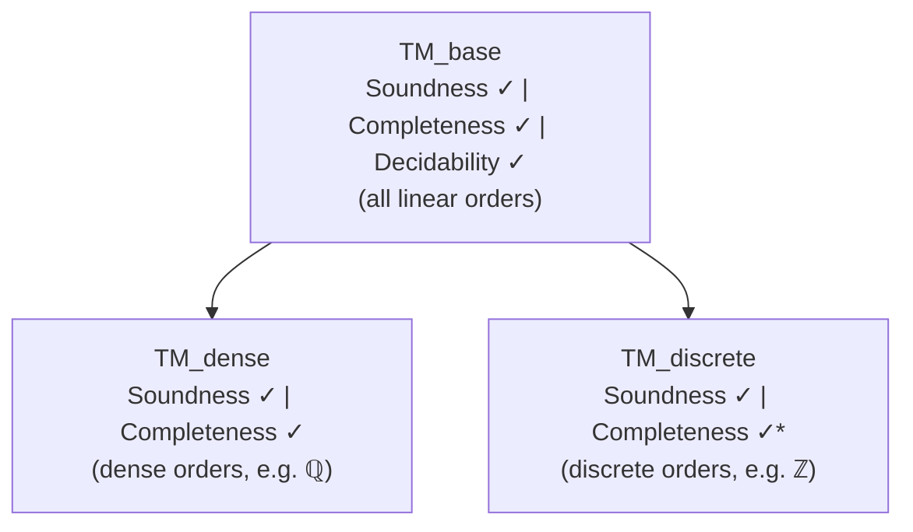

# Teammate A Findings: Primary Angle — Metalogic Structure, Operators, and README Content

**Task**: 158 — Update README.md to reflect metalogic progress and improve organization
**Date**: 2026-05-17
**Confidence Level**: High

## Key Findings

### 1. Current README Shortcomings

The current README.md (235 lines) has several issues:
- **Codebase size at bottom**: appears as a detached afterthought in a standalone section near the end
- **No mention of Logos Laboratories**: the broader system context is absent
- **Stale operator table**: lists `H`/`G` as `all_past`/`all_future` but omits the Until (`U`) and Since (`S`) binary operators which are primitive constructors
- **Stale axiom count**: says "14 axioms, 7 rules" — the actual system has **44 axiom constructors** organized in 7 layers and **7 inference rules**
- **Stale codebase numbers**: lists 162 files / ~30,000 lines — actual `cloc` shows **189 files / 42,706 lines of code / 28,421 comment lines** (excluding Boneyard)
- **Redundant sections**: Contributing section duplicates installation instructions; Installation Guides table includes overly-basic USING_GIT.md
- **Missing frame hierarchy**: no explanation of the Base/Dense/Discrete extension structure
- **Missing literature citations**: Burgess, Xu, Goldblatt, Reynolds, Doets, Venema are all used extensively but uncited in the README
- **Stale "Theoretical Foundations" section**: duplicates the paper link from the header and adds little

### 2. Logical Operators (from Formula.lean)

The `Formula` inductive type has **8 constructors** (6 primitive, 2 binary temporal):

**Primitive constructors:**
| Constructor | Symbol | Reading |
|------------|--------|---------|
| `atom` | p, q, ... | propositional variable |
| `bot` | ⊥ | falsum |
| `imp` | → | implication |
| `box` | □ | necessity (S5) |
| `all_past` | H | "has always been" |
| `all_future` | G | "will always be" |
| `untl` | U(φ,ψ) | "ψ until φ" (Burgess convention) |
| `snce` | S(φ,ψ) | "ψ since φ" (Burgess convention) |

**Key derived operators:**
| Operator | Symbol | Definition |
|----------|--------|------------|
| `neg` | ¬ | φ → ⊥ |
| `and` | ∧ | ¬(φ → ¬ψ) |
| `or` | ∨ | ¬φ → ψ |
| `diamond` | ◇ | ¬□¬φ |
| `some_past` | P | ¬H¬φ |
| `some_future` | F | ¬G¬φ |
| `always` | △ | Hφ ∧ φ ∧ Gφ |
| `sometimes` | ▽ | ¬△¬φ |
| `next` | X | U(φ, ⊥) |
| `prev` | Y | S(φ, ⊥) |

### 3. Task Frame Semantics

A **TaskFrame D** (parameterized over an ordered abelian group D) consists of:
- `WorldState : Type` — set of world-states (metaphysically possible states)
- `task_rel : WorldState → D → WorldState → Prop` — the task relation
- `nullity_identity`: zero-duration task = identity (`task_rel w 0 u ↔ w = u`)
- `forward_comp`: forward compositionality for non-negative durations
- `converse`: `task_rel w d u ↔ task_rel u (-d) w` (temporal symmetry)

The temporal domain D can be instantiated as `Int` (discrete), `Rat` (dense), or `Real` (continuous).

### 4. Axiom System (from Axioms.lean)

The BX (Burgess-Xu) axiom system has **44 axiom constructors** organized into **7 layers**:

1. **Propositional** (4): prop_k, prop_s, ex_falso, peirce
2. **S5 Modal** (5): modal_t, modal_4, modal_b, modal_5_collapse, modal_k_dist
3. **BX Temporal** (24): 12 future/past pairs including:
   - BX1/BX1': seriality
   - BX2G/BX2H: guard monotonicity under G/H
   - BX3/BX3': event monotonicity
   - BX4/BX4': temporal connectedness
   - BX5/BX5': self-accumulation
   - BX6/BX6': absorption
   - BX7/BX7': linearity
   - BX10/BX10': eventuality extraction
   - BX11/BX11': temporal linearity (F/P)
   - BX12/BX12': F-Until / P-Since bridge
   - BX13/BX13': Until-Since enrichment
4. **Modal-Temporal Interaction** (1): modal_future (□φ → □Gφ)
5. **Uniformity** (5): discrete symmetry, propagation, box necessity
6. **Prior** (2): prior_UZ (Fφ → U(φ,¬φ)), prior_SZ (Pφ → S(φ,¬φ))
7. **Z1** (1): G(Gφ→φ) → (FGφ→Gφ) (IsSuccArchimedean characteristic)

**7 Inference Rules** (from Derivation.lean):
1. axiom — axiom schema instantiation
2. assumption — context membership
3. modus_ponens — implication elimination
4. necessitation — □ necessitation (theorems only)
5. temporal_necessitation — G necessitation (theorems only)
6. temporal_duality — past/future swap (theorems only)
7. weakening — context monotonicity

### 5. Metalogical Results

The Metalogic/ directory contains substantial formalization organized around three extension levels:

#### Frame Hierarchy
```
LinearTemporalFrame (AddCommGroup + LinearOrder + IsOrderedAddMonoid)
        |
   SerialFrame (+ Nontrivial + NoMaxOrder + NoMinOrder)
      /    \
DenseTemporalFrame         DiscreteTemporalFrame
(+ DenselyOrdered)         (+ SuccOrder + PredOrder + IsSuccArchimedean)
```

#### Proven Results by Extension Level

**Base (all linear orders)**:
- **Soundness** (`soundness`): SORRY-FREE, AXIOM-FREE — proven for all 34 base axioms
- **Base Completeness** (`base_truth_lemma`): SORRY-FREE, AXIOM-FREE
- **Deduction Theorem**: proven (Core/DeductionTheorem.lean)
- **Decidability** (`decide`): SORRY-FREE, AXIOM-FREE — tableau-based decision procedure
- **Finite Model Property**: FMP with filtration
- **Perpetuity Principles** (P1-P6): all 6 fully proven

**Dense (dense linear orders)**:
- **Dense Soundness** (`soundness_dense`): density axiom DN = Fφ → FFφ valid on dense frames
- **Dense Completeness** (`dd_countermodel_chronicle_dense`): sorry-free for dense case

**Discrete (discrete linear orders = ℤ)**:
- **Discrete Soundness** (`soundness_discrete`): Prior-UZ/SZ + Z1 axiom valid on discrete frames
- **Discrete Completeness** (`bx_completeness`): 1 root sorry remaining (`succ_cofinal`)
- **Conservative Extension**: IRR rule handling via Goldblatt construction

#### Additional Infrastructure
- **Algebraic/**: Tense S5 algebras, Lindenbaum quotient, ultrafilter-MCS bridge, parametric representations
- **BXCanonical/**: Chronicle construction (Burgess 1982), quasimodel/Hintikka-point approach, filtration
- **WeakCanonical/**: Reynolds/Doets discrete completeness pipeline, monadic FO, k-equivalence, ordered sums
- **ConservativeExtension/**: Extended formula type, lifting infrastructure

### 6. Package Name and Logos Connection

The `lakefile.lean` declares the package as **`Logos`**:
```lean
package Logos
```

This confirms the project is part of the broader Logos system. The README should explain that this is the intensional bimodal fragment, formally verified in Lean 4.

### 7. Literature References in Codebase

Extensively cited authors and works found in source:
- **Burgess 1982**: "Axioms for tense logic: Since and Until" — chronicle construction
- **Burgess 1984**: "Basic tense logic" — canonical model construction
- **Xu 1988**: Completeness for Until-Since on linear orders (Lemmas 3.2.1, 3.2.2)
- **Goldblatt 1992**: "Logics of Time and Computation" — IRR rule, naming argument
- **Reynolds 1994**: Theorems 14-18 for discrete completeness pipeline
- **Doets 1987/1989**: Completeness & definability, monadic Π₁¹ theories, k-types
- **Venema 1993**: Temporal logic survey, axiom (W)
- **Blackburn, de Rijke, Venema 2002**: "Modal Logic" — canonical model theory (Ch. 4)
- **Gabbay, Hodkinson, Reynolds 1993/1994**: Temporal expressive completeness, GHR94

The author's own paper:
- **Brast-McKie 2025**: "The Construction of Possible Worlds" — task semantics, perpetuity calculus

### 8. Codebase Statistics (updated via cloc)

| Metric | Count |
|--------|-------|
| Lean files | 189 |
| Lines of code | 42,706 |
| Comment lines | 28,421 |
| Blank lines | 11,881 |
| Total lines | ~83,000 |

(Excludes `.lake`, `lake-packages`, and `Boneyard/` directories)

### 9. Cleanup Candidates

**Examples directory**: 6 of 9 files contain `sorry`. These are pedagogical exercises with intentional sorries for students to fill in. As the project has matured from a teaching resource to a publication-quality formalization, these are candidates for removal or relegation.

**Documentation too basic for current scope**:
- `docs/installation/USING_GIT.md` — git basics (clone, branch, push)
- `docs/installation/GETTING_STARTED.md` — terminal basics, VS Code setup
- Multiple User Guides (Tutorial, Quick Start, Examples, Proof Patterns, Troubleshooting) — teaching-oriented

## Recommended Approach

### README Structure (proposed order)

1. **Title + one-line description** — Lean 4 formalization of bimodal tense logic (S5 + temporal)
2. **Logos context** — intensional bimodal fragment of the Logos, link to Logos Labs
3. **Paper + Demo + Spec links** (brief)
4. **Operators table** (updated with U/S)
5. **Task Semantics** (brief conceptual paragraph)
6. **Codebase size** (end of intro section — as requested)
7. **Project Structure** (directory tree)
8. **Installation** (simplified — drop basic guides, keep Claude Code + manual)
9. **Metalogical Results** (soundness, completeness, decidability with mermaid diagram of extensions)
10. **Documentation** (pruned — remove teaching-oriented docs)
11. **Related Projects** (ModelChecker)
12. **Citation** (BibTeX for paper + software, add literature references)
13. **License**

### Mermaid Diagram for Frame Hierarchy


(*1 sorry remaining on discrete completeness path)

## Evidence/Examples

**Perpetuity P1 from Theorems/Perpetuity.lean:**
```lean
theorem perpetuity_1 : DerivationTree [] (φ.box.imp φ.always)
-- □φ → △φ: what is necessary is perpetual
```

**Soundness from Metalogic/Soundness.lean:**
```lean
theorem soundness (Γ : Context) (φ : Formula) (d : DerivationTree Γ φ) (h_dc : d.isDenseCompatible)
    ... : (∀ ψ ∈ Γ, truth_at M Omega τ t ψ) → truth_at M Omega τ t φ
```

**Decision procedure from Decidability:**
```lean
#check decide        -- Main decision procedure
#check isValid       -- Boolean validity check
#check isSatisfiable -- Boolean satisfiability check
```
