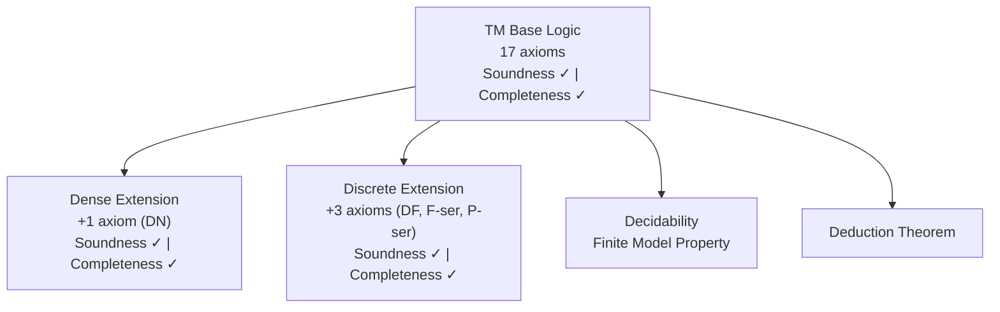

# Teammate B Findings: Cleanup Opportunities, Literature, and Documentation Review

**Task**: 158 — Update README.md to reflect metalogic progress and improve organization
**Date**: 2026-05-17
**Angle**: Alternative approaches — cleanup, literature, and docs audit

## Key Findings

### 1. Documentation Cleanup — Beginner-Oriented Files to Remove

The `docs/installation/` directory contains teaching-oriented material inappropriate for a research repository:

| File | Content | Recommendation |
|------|---------|----------------|
| `docs/installation/USING_GIT.md` | Explains "What is GitHub?", how to install Git, beginner git workflows | **Remove** — too basic |
| `docs/installation/GETTING_STARTED.md` | Terminal basics ("What is the Terminal?", how to open Terminal on macOS) | **Remove** — too basic |
| `docs/installation/CLAUDE_CODE.md` | AI-assisted installation via Claude Code | **Remove** — product-specific, not research-relevant |
| `docs/installation/BASIC_INSTALLATION.md` | Manual install guide (elan, lake build) | **Keep** — but fold key steps into README Installation section |
| `docs/installation/README.md` | Index pointing to all above | **Remove** or simplify |

Additional docs candidates for removal:
- `docs/tts-stt-integration.md` — Text-to-speech/speech-to-text for Claude Code + Neovim. Completely unrelated to the logic project.
- `docs/bfmcs-architecture.md` — Internal completeness proof architecture doc. Useful for contributors but not README-linked material. Mentions "4 remaining sorries" which is outdated.
- `docs/development/DOC_QUALITY_CHECKLIST.md` — Meta-documentation about documentation quality
- `docs/development/PHASED_IMPLEMENTATION.md` — Internal roadmap, not user-facing
- `docs/project-info/MAINTENANCE.md` — Internal TODO workflow

### 2. Examples Directory — Sorry Audit

The `Theories/Bimodal/Examples/` directory has significant sorry content:

| File | Sorries | Recommendation |
|------|---------|----------------|
| `TemporalProofs.lean` | 30 | **Remove** — heavily incomplete |
| `TemporalProofStrategies.lean` | 19 | **Remove** — heavily incomplete |
| `ModalProofs.lean` | 5 | **Remove** — incomplete |
| `ModalProofStrategies.lean` | 5 | **Remove** — incomplete |
| `Demo.lean` | 4 | **Fix or remove** — this is the README-linked demo file |
| `BimodalProofStrategies.lean` | 2 | **Remove** — incomplete |
| `BimodalProofs.lean` | 0 | **Keep** — sorry-free |
| `TemporalStructures.lean` | 0 | **Keep** — sorry-free |

**Critical issue**: `Demo.lean` is linked directly from the README as the demo file but contains 4 sorries. The main sorry is in `main_provable_iff_valid` which has a "PROOF DEBT" comment about the completeness direction. This must be fixed or the README demo link should point to `BimodalProofs.lean` instead.

**Recommendation**: Remove the 6 files with sorries. Keep `BimodalProofs.lean` and `TemporalStructures.lean`. Either fix `Demo.lean` or replace the README demo link.

### 3. Codebase Size — Updated Numbers

Current metrics (excluding `.lake/` and `Boneyard/`):

| Metric | Old (README) | Current | Change |
|--------|-------------|---------|--------|
| Lean files | 162 | **189** | +27 |
| Lines of code | ~30,000 | **~42,700** | +12,700 |
| Comment lines | ~24,000 | **~28,400** | +4,400 |
| Total lines | — | **~83,000** | — |

The README should be updated to reflect ~43k lines of Lean code across 189 files.

### 4. Literature for Citation Section

The project has an extensive `literature/` directory (60 files, 30 papers). Key citations for the README:

**Core references to cite**:

1. **Brast-McKie (2025)** — "The Construction of Possible Worlds" (already linked in README)
   - URL: `https://benbrastmckie.com/wp-content/uploads/2026/05/possible_worlds.pdf`

2. **Burgess (1982)** — "Axioms for tense logic. I. 'Since' and 'until'" — Original BX axiomatization
   - DOI: `10.1305/ndjfl/1093870149`

3. **Xu (1988)** — "On some U,S-tense logics" — The "X" in BX, extends to non-linear time
   - DOI: `10.1007/BF00247911`

4. **Thomason (1984)** — "Combinations of Tense and Modality" — Standard reference for modal-temporal combinations

5. **Venema (1993)** — "Since and Until" — Extends BX to strict/discrete time; "Completeness via Completeness"

6. **Reynolds (1994)** — "Axiomatising U and S over integer time" — Discrete-time axiomatization

7. **Gabbay, Hodkinson & Reynolds (1994)** — *Temporal Logic: Mathematical Foundations*, Vol. 1 — Definitive reference for expressive completeness

8. **Caleiro, Viganò & Volpe (2013)** — "On the Mosaic Method for Many-Dimensional Modal Logics" — Completeness for S5 + linear tense

### 5. Logos Connection

The `docs/research/bimodal-logic.md` already has a "The Logos Connection" section (line 125):
> "Bimodal logic is a fragment of the **Logos**, a formal language of thought designed to enable AI systems to reason with mathematical certainty."

The README currently does NOT mention Logos or link to `https://logos-labs.ai/`. The `ModelChecker` description mentions "Logos semantic theory" but without the Logos Labs link.

### 6. CI/CD and Badges

- `.github/workflows/ci.yml` exists with `leanprover/lean-action@v1`
- Runs on push to main (with `[ci]` marker), PRs, and workflow_dispatch
- Builds with `--wfail` flag
- No badge is currently in the README
- Could add: ``

### 7. Current README Structure Issues

The current README has these structural problems:
- Codebase Size appears at the very end (section before Contributing) — should be earlier per task description
- No mention of Logos or Logos Laboratories
- "Demo" links to `Demo.lean` which has 4 sorries
- Documentation section is heavily tutorial-oriented (links to beginner guides)
- Two paper URLs that differ: top link vs. citation section link (different dates in URL path)
- Contributing section repeats the clone+build commands from Installation
- No mermaid diagram showing logic extensions

## Recommended Approach

### README Section Ordering (proposed)

1. Title + one-line description + Logos Labs connection
2. Paper link, Specifications link, Demo link
3. Overview (operators, task frame semantics, key results)
4. Codebase size (end of intro, as requested)
5. Project Structure
6. Installation (streamlined — no links to USING_GIT or GETTING_STARTED)
7. Metalogical Results (soundness/completeness mermaid diagram for base + extensions)
8. Documentation (link to relevant reference docs, not beginner tutorials)
9. Related Projects (ModelChecker)
10. Citation (bibtex + key literature references)
11. License

### Files to Remove/Deprecate

**Remove entirely**:
- `docs/installation/USING_GIT.md`
- `docs/installation/GETTING_STARTED.md`
- `docs/installation/CLAUDE_CODE.md`
- `docs/tts-stt-integration.md`
- `Theories/Bimodal/Examples/TemporalProofs.lean` (30 sorries)
- `Theories/Bimodal/Examples/TemporalProofStrategies.lean` (19 sorries)
- `Theories/Bimodal/Examples/ModalProofs.lean` (5 sorries)
- `Theories/Bimodal/Examples/ModalProofStrategies.lean` (5 sorries)
- `Theories/Bimodal/Examples/BimodalProofStrategies.lean` (2 sorries)

**Fix or remove**:
- `Theories/Bimodal/Examples/Demo.lean` (4 sorries — README links here)

### Mermaid Diagram for Metalogic

## Evidence/Examples

- Codebase metrics: `cloc` output showing 189 files, 42,706 code lines, 28,421 comment lines
- Sorry scan: `grep -r "sorry"` across 45 files (many in Boneyard dead code)
- Literature directory: 30 papers covering completeness theory, algebraic representation, expressive completeness
- CI: `.github/workflows/ci.yml` with lean-action
- Logos reference: `docs/research/bimodal-logic.md` line 125-127

## Confidence Level

**High** — All findings based on direct file inspection. Codebase metrics verified via `cloc`. Sorry counts verified via `grep`. Literature inventory complete.
