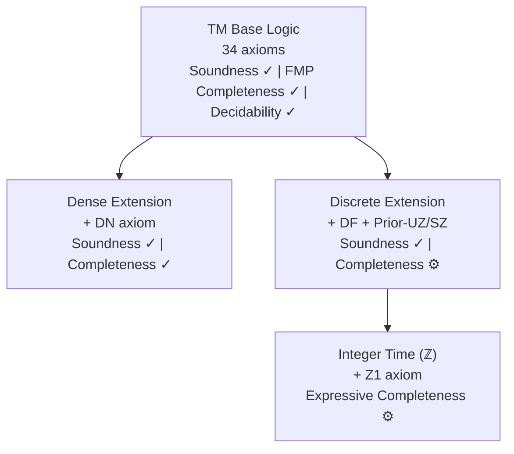

# Teammate D (Horizons) Findings: README Strategic Positioning

**Task**: 158 — Update README.md to reflect metalogic progress and improve organization
**Date**: 2026-05-17
**Confidence**: High

---

## Key Findings

### 1. The Project Has Outgrown Its README

The current README reads like a project that's still proving basic results. In reality, this is one of the most complete Lean 4 formalizations of a non-trivial bimodal logic in existence. The codebase is **189 Lean files, ~43,000 lines of code, ~28,000 lines of comments** — substantially larger than the README's stale "162 files, ~30,000 lines" figure. The metalogic includes:

- **Soundness**: Sorry-free for all 3 frame classes (general, dense, discrete)
- **Completeness**: FMP completeness (sorry-free), dense completeness (sorry-free), discrete completeness (structurally complete, active work on Reynolds pipeline)
- **Decidability**: Sorry-free tableau-based decision procedure with proof/countermodel extraction
- **Deduction theorem**: Fully proven
- **Finite model property**: Proven with 2^|closure(φ)| size bound
- **Conservative extension**: Lifting from base to extended formulas
- **Algebraic**: Lindenbaum quotients, Tense S5 algebras, parametric representation
- **Expressive completeness**: Separation theorem for {U,S} over integer time (in progress, task 157)

The current README buries or omits most of these results.

### 2. Frame Class Hierarchy Is the Central Story

The metalogic is organized around a 4-tier frame class hierarchy defined in `FrameConditions/FrameClass.lean`:

```
LinearTemporalFrame (base: AddCommGroup + LinearOrder)
        |
   SerialFrame (+ Nontrivial + NoMaxOrder + NoMinOrder)
      /    \
DenseTemporalFrame          DiscreteTemporalFrame
(+ DenselyOrdered)          (+ SuccOrder + PredOrder + IsSuccArchimedean)
```

Each tier has its own:
- **Axiom set**: 34 base + density axiom DN for dense, discreteness DF + Prior-UZ/SZ for discrete
- **Soundness theorem**: `soundness`, `soundness_dense`, `soundness_discrete`
- **Completeness proof**: Different construction techniques per tier
- **Validity notion**: `valid`, `valid_dense`, `valid_discrete`

This hierarchy is the natural centerpiece for a mermaid diagram in the README.

### 3. The Operators Table Needs Updating

The current README lists G/H/P/F but omits **Until (U)** and **Since (S)**, which are primitive constructors in `Formula.lean` and central to the completeness proof (Burgess-Xu axiomatization). The operator table should include:

| Symbol | Lean | Reading |
|--------|------|---------|
| `□φ` | `box φ` | necessity |
| `◇φ` | `diamond φ` | possibility |
| `Gφ` | `all_future φ` | always henceforth |
| `Hφ` | `all_past φ` | always heretofore |
| `Fφ` | `some_future φ` | sometime hence |
| `Pφ` | `some_past φ` | sometime before |
| `U(φ,ψ)` | `untl φ ψ` | ψ until φ |
| `S(φ,ψ)` | `snce φ ψ` | ψ since φ |
| `△φ` | `always φ` | perpetuity (derived: Gφ ∧ φ ∧ Hφ) |
| `▽φ` | `sometimes φ` | occurrence (derived: Fφ ∨ φ ∨ Pφ) |

### 4. Literature Coverage Is Impressive and Should Be Cited

The `literature/` directory contains 30+ primary sources including:
- **Burgess 1982/84**: The original axiomatization this project formalizes
- **Xu 1988**: Completeness proof extended here
- **Reynolds 1992/94**: Pipeline for discrete completeness
- **Doets 1987/89**: Monadic FO framework used in Reynolds pipeline
- **Gabbay, Hodkinson, Reynolds 1994**: Temporal logic foundations (separation theorem)
- **Venema 1991/93/97**: Many-dimensional modal logics, algebraic methods
- **Blackburn, de Rijke, Venema 2002**: Modal logic textbook (canonical models)

The README citation section should reference at minimum Burgess, Xu, and Brast-McKie's own paper. The References section could list the major literature sources.

### 5. Logos Connection Should Be Front and Center

The existing `docs/research/bimodal-logic.md` already has a clear "Logos Connection" paragraph:

> "Bimodal logic is a fragment of the **Logos**, a formal language of thought designed to enable AI systems to reason with mathematical certainty. The Logos provides verified synthetic reasoning data of arbitrary complexity through an extensible system of proof theory and semantics."

This should be in the README introduction, not buried in a docs file.

### 6. Content to Remove or Demote

Several parts of the current README are too pedagogical for a research-grade repository:

- **Installation guides table**: USING_GIT.md (453 lines on "What is GitHub?") and GETTING_STARTED.md (terminal basics, VS Code setup) are teaching resources. These are fine to keep in `docs/` but should not be prominently linked from the README. The README should have a streamlined installation section with `elan` + `lake build`.
- **Contributing section**: Duplicates the installation instructions. Should be a one-liner pointing to CONTRIBUTING.md.
- **Directory Convention**: Too detailed for the README.
- **User Guides section**: The tutorial and quickstart are fine to link, but the documentation section is bloated. A curated selection is better.

### 7. Examples Directory Has Sorries

6 of 8 Example files contain sorries:
- `Demo.lean` (4 sorries)
- `BimodalProofStrategies.lean`
- `ModalProofs.lean`
- `TemporalProofs.lean`
- `TemporalProofStrategies.lean`
- `ModalProofStrategies.lean`

These are presumably exercise stubs from when this was a teaching resource. The user wants to remove them. Options:
1. **Move to Boneyard** — archive examples with sorries
2. **Fix the sorries** — complete them as actual proofs
3. **Keep Demo.lean only** — if Demo has interesting demonstrative content despite sorries

The README currently links to `Demo.lean` — if it retains sorries, it should not be the showcase file.

---

## Strategic Recommendations

### 1. Position as a Research Contribution, Not a Teaching Tool

The README should open with what makes this project unique in the formal verification landscape:
- **First** complete Lean 4 formalization of bimodal temporal+modal logic with soundness, completeness, and decidability
- **Novel semantics**: Task frame semantics (non-deterministic dynamical systems)
- **Industrial-scale formalization**: 43K lines, sorry-free soundness/decidability, zero custom axioms

### 2. Proposed README Section Order

```
1. Title + one-sentence description
2. Overview paragraph (Logos connection, what TM is, task semantics)
3. Paper link + demo link
4. Codebase size table (end of intro, per user request)
5. Operators table (complete, including U/S)
6. Task Frame Semantics (brief)
7. Project Structure (updated, highlighting Metalogic)
8. Installation (streamlined: elan + lake build, link to detailed docs)
9. Metalogical Results (mermaid diagram of frame hierarchy + results table)
10. Documentation (curated links, not exhaustive)
11. Related Projects (ModelChecker + Logos Labs)
12. Citation (BibTeX for both the software and the paper)
13. License
```

### 3. Mermaid Diagram Design



### 4. Clean Up Beyond the README

- Archive or fix Example files with sorries
- Consider removing `docs/installation/USING_GIT.md` and `docs/installation/GETTING_STARTED.md` from the repository (or move to a wiki)
- Update `docs/research/bimodal-logic.md` to match the new README

---

## Audience Analysis

### Primary Audience: Formal Methods Researchers
- Want to know: What logic? What results are proven? How trustworthy (sorry count)?
- Need: Clear statement of theorems, axiom system, frame conditions
- Value: Zero custom axioms, sorry-free soundness/decidability

### Secondary Audience: Logic/Philosophy Researchers
- Want to know: What philosophical theory? How does it relate to existing work?
- Need: Paper link, Logos context, perpetuity principles
- Value: Task semantics as compositional semantics for time and modality

### Tertiary Audience: Lean 4 Developers
- Want to know: How to build and use? What tactics available?
- Need: Installation instructions, API reference
- Value: Working examples, proof automation

### Who Should NOT Be the Target
- Students learning Git/GitHub basics (USING_GIT.md audience)
- People who don't know what a terminal is (GETTING_STARTED.md audience)
- These audiences can be served by docs/ but should not shape the README

---

## Confidence Level

**High**. The strategic analysis is grounded in:
- Direct reading of 90+ Lean source files across all Metalogic subdirectories
- ROADMAP.md documenting the completeness architecture and sorry status
- Existing documentation in `docs/research/bimodal-logic.md` with Logos connection
- The literature/ directory contents establishing the scholarly foundation
- Current codebase metrics (189 files, 43K LOC) from `cloc`

The proposed section order aligns with how formal verification projects are typically presented in the research community (e.g., Mathlib documentation, lean4 projects on GitHub). The emphasis on the frame class hierarchy as the organizing principle for metalogical results is well-supported by the code architecture.
